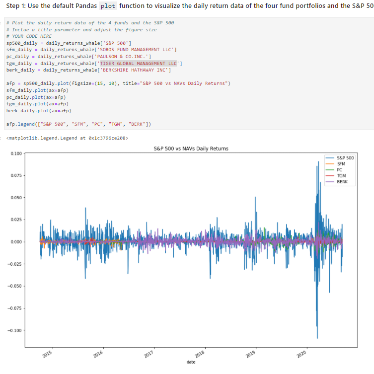

# module_4_challenge

The module 4 challenge for fintech course

The Jupyter Lab file follows along as an exercise to analyze risk and reward, following statistics like standard deviation, shapre ratio and beta.

---

## Technologies

The sheet requires Pandas for analyzing data frames in jupyter labs.
It requires Jupyter Labs for a user interface.
It requires Path from pathlib to help read .csv files.

---

## Installation Guide

Other than Python 3.7, no installation is necessary, Jupyter Labs runs in a browser, including Chrome.  Launch the file by navigating to the directory of the file through a CLI and then running Jupyter labs, with "jupyter lab".

---

## Usage

The worksheet runs through a scenario and allows the user to manipulate daily closing values to calculate average daily return.
Follow the instructions provided.

---

## Contributors

Michael Canavan

---

## License

the content of the course is owned and managed by UC Berkeley Fintech Bootcamp.